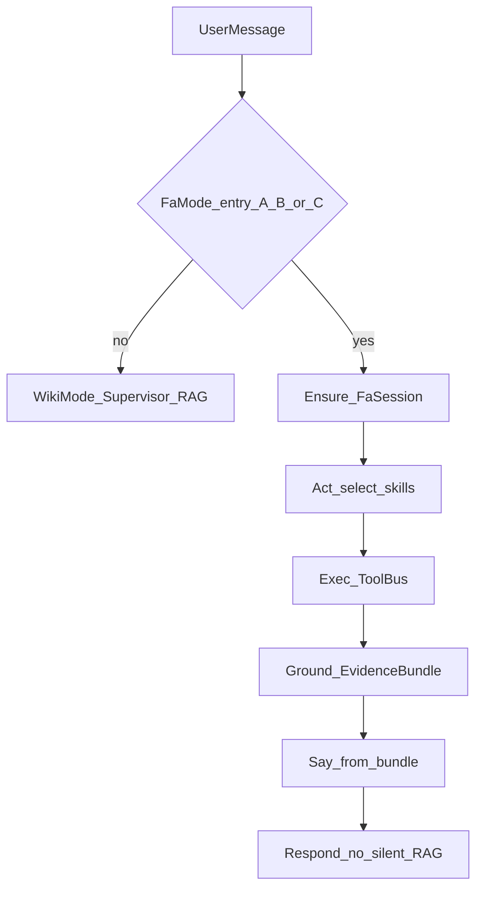

# FA Session — target architecture

**Status:** Target contract (amends ADR 0010 session keying; ADR 0012 mode split).  
Implementation plan for Workbuddy: [fa-agent-implementation-plan.md](fa-agent-implementation-plan.md).

## Goal

Open WebUI 上的 **FA Assistant**：同一对话 LLM，**FaMode** 由 **FaAgent** 按需调用共享 ToolBus（Radar / Flames / full trace / 相似 case 等）。

- 票面 / 产线 / 追网事实 → 工具 provenance 接地；写 Radar 须 **confirm**
- **无 Radar 号也可进 FaMode**（现象 / 位号先查）；有票后再 bind
- 能力在 ToolBus；FaAgent / 未来 FbAgent = 不同 allowlist，不复制 handlers

## Mode split

```text
Open WebUI  →  POST /v1/chat/completions  →  EE-Wiki Chat Runtime
                                                    │
                         ┌──────────────────────────┴──────────────────────────┐
                         │                                                      │
                    WikiMode                                               FaMode
                         │                                                      │
                         ▼                                                      ▼
              Supervisor → hybrid RAG                                 FaAgent + ToolBus
              （答案绑检索 citations）                                  Act → Exec → Ground → Say
```

### FaMode 入口（必须同时支持）

| # | 条件 | 行为 |
|---|------|------|
| A | 结构：`radar://` / `rdar://` / **`rdar://problem/{id}`**（真实网页格式） / `radar <digits>` | 开案或刷新；`case_id = radar_id` |
| B | History 已是 FA 会话（见下） | 保持 FaMode，不静默 RAG |
| C | **FA 调查意图**（无票也可） | 进 FaMode；`radar_id=null` 的 ephemeral case；可追问是否绑票 |
| — | 以上皆否 | **WikiMode** |

**C 的判定（合同）：**

- **主路径**：本地 LLM + prompt（`prompts/fa/classify_mode.md` 或等价）→ `MODE: fa | wiki`  
  - `fa` 例：帮我 FA / 失效分析 / 排查为什么某位号没输出 / 客退 / debug 这颗料…  
  - `wiki` 例：某芯片核心参数、SOP 怎么写、翻译上一条（无调查意图）
- **禁止**把「FA」两字正则当唯一主路由（换措辞即呆）
- **兜底**（无 LLM / classify 失败）：保守 → WikiMode（或极窄结构启发，不得假阳性吞掉普通 wiki）

绑定识别（B）不仅 `FA check-in — rdar://…`，还包括 **无票** 会话头，例如：

```text
**FA（未绑定 Radar）：** U8600 IIC 无输出
## FA check-in — rdar://101493937
```

> 无票会话头已精简为一行可读文字（`**FA（未绑定 Radar）：** <symptom>`），
> 不再输出 `## FA session — unbound` / `**Symptom:**` / `**EE-Wiki scope:**` 三行块，
> 也不在回答里贴原始工具 JSON（`### Tool evidence`）。scope 通过不可见的
> `<!-- ee-wiki-scope: product/project/build -->` marker 跨轮携带（见 ADR 0012 §6）。

## FaMode 回合



1. **Ensure_FaSession** — 有 `radar_id` 则拉票/瀑布；无票则建立 ephemeral session（scope 可从问句推断 logan/p1）。
2. **Act** — LLM 在封闭 skill 表选 0..N 工具（tool_calls 或结构化选技）。
3. **Exec** — ToolBus；写操作无 confirm 不提交；无票时 Radar 写类 skill 不可用或返回「请先绑定 radar」。
4. **Ground** — EvidenceBundle + provenance。
5. **Say** — 仅基于 bundle；缺强制证据则追问/拒答，不编票面事实。

无票时仍可：`trace_net` / `query_schematic` / `search_debug_case` / `engineering_search` / 请用户贴 log；并提示「有 Radar 号可绑票拉 diagnosis/附件」。

## ToolBus 与 Agent 组装

```text
                    ToolBus（一份实现）
  Radar | Flames | trace_net | search_debug_case | engineering_search | …
              ▲ allowlist              ▲ allowlist
         FaAgent                    FbAgent（例）
         全套                        Radar+Trace only
```

追网 / Flames = FaAgent 调工具，不是再唤起 HW/PCB/Flames 人格 agent。

## 有票开案瀑布（radar_id 已知时）

```text
get_problem → Flames fails → else Radar 文本抽 fail → else 请粘贴
→ cache data/cache/fa/{radar_id}/
```

Stub 金样：`rdar://101493937`（Scarif / radar.log）。

## Session 状态（ephemeral）

| Field | Meaning |
|-------|---------|
| `case_id` | 稳定会话 id；有票时等于 `radar_id`，无票时为生成的 ephemeral id |
| `radar_id` | `null` 或已绑定票号 |
| `product` / `project` / `build` | EE-Wiki scope |
| `symptom` / 开场问句 | 无票时的调查锚点（如 U8600 IIC 无输出） |
| `fail_items[]` / `log_refs[]` | 证据 |
| `radar_snapshot` | 有票时的票面摘要 |
| `pending_writes` | 待 confirm |
| `true_fail` | 人工确认（可选） |

后续用户发 `radar://…` → **bind** 到当前 FA 会话（合并 scope/证据，再跑开案瀑布）。

## 与今日实现的差距

| 目标 | 今日 |
|------|------|
| 入口 A+B+C | 几乎只有 A + 部分 B（有票头） |
| 「帮我FA一下 U8600…」→ FaMode | 落入 WikiMode / hw+RAG |
| FaAgent 选技 | Supervisor → `radar` recipe / classify 补丁 |
| `radar_id=null` session | 无 |
| 有票 FA 会话「额外的建议动作？」→ ToolBus 追网/搜 case | 旧：只读 recap，答“没有”，不追网（bug）；新：bound 走 `select_fa_skills` → 命中 `INVESTIGATION_TOOLS` 即跑 ToolBus，`bound_suggestion_summary.md` 落地（Radar 已有 / 非 Radar 原文 分栏）。见 `fa_agent.py` bound 分支（Act→Exec→Ground→Say） |
| 「整理成 FA one page keynote / 导出报告」→ 生成 .key 下载 | 旧：未接入 / LLM 自由 markdown；新：`_ABOUT_FA_KEYNOTE` → `generate_fa_summary`：Summary 表（radar/项目/state）+ diagnosis 步骤 + Conclusion（最新状态），macOS 上 AppleScript 生成真 `.key`，并写 `FA_summary.md` 预览 |

## 验收金句（Lab）

1. `radar://101493937` → 有票 FA check-in  
2. `帮我FA一下为什么U8600（logan p1）的IIC接口没有输出` → **FaMode**（unbound），不是纯 wiki 长文；可追网/搜 case/要 scope  
3. 同一会话再发 `radar://101493937` → bind + 拉票  
4. `STM32F407 核心参数`（无 FA 意图）→ WikiMode  
5. FA 会话内「列出 diagnosis 步骤」→ 原文，不编 true-fail  

## Related

- [fa-agent-implementation-plan.md](fa-agent-implementation-plan.md) — Workbuddy 施工单  
- [ADR 0010](../adr/0010-fa-session-external-integrations.md) — 有票时仍以 radar 为外部系统主键；无票 ephemeral 为增补  
- [ADR 0012](../adr/0012-chat-pipeline-grounding.md) · [ADR 0008](../adr/0008-multi-agent-runtime.md)  
- [agents.md](../usage/agents.md)
